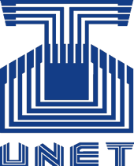

  

## Protocolo para la realización de un Dominó en una LAN
### Proyecto II de Comunicaciones I

Este repositorio será el punto de encuentro para sugerir e implementar las modificaciones que se le harán al protocolo de comunicación del último proyecto de Comunicaciones I

### Desarrolladores
* Cursantes de la unidad curricular "Comunicaciones I" del lapso 2017-I

*Proyecto desarrollado con propositos educativos para la **Universidad Nacional
Experimental del Táchira***
